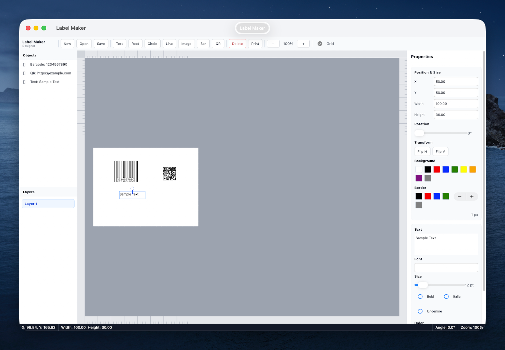

# Label Maker

A cross-platform label design application built with .NET MAUI for creating printable labels with text, shapes, images, barcodes, and QR codes.

The app provides a WYSIWYG label design workspace with an artboard, rulers, object list, layers, transform handles, and a properties panel.



## Features

### Design Elements
- **Text Elements** - Rich text editing with font family, size, bold, italic, underline, color, and alignment
- **Shapes** - Rectangles, circles, and lines with fill, border, color options
- **Images** - Pick images from the file explorer, import them into app storage, and position them on labels
- **Barcodes** - Generate real 1D barcodes (CODE128, CODE39, EAN13, UPC)
- **QR Codes** - Generate real QR codes with customizable data

### Professional UI
- **Menu Bar** - Standard File, Edit, Create, View, Arrange menus
- **Icon Toolbar** - Quick access to common tools
- **Object Tree Panel** - Left panel showing all objects on the label
- **Layers Panel** - Organize elements into layers
- **Canvas with Rulers** - Top, bottom, left, right rulers for precise positioning
- **Grid Overlay** - Optional grid for alignment
- **Properties Panel** - Right panel for editing element properties
- **Status Bar** - Shows position, dimensions, angle, and zoom level
- **Transform Handles** - Move, resize from edges/corners, rotate, and flip selected elements

### Tools
- **Drag & Drop** - Intuitive positioning of elements on the artboard
- **Resize and Rotate** - Photoshop-style edge/corner handles and rotation handle for all element types
- **Flip** - Horizontal and vertical flip controls for selected elements
- **Zoom** - Zoom in/out from 30% to 300%
- **Save & Load** - JSON-based template persistence
- **Print** - Generate HTML for browser-based printing
- **Cross-Platform** - Single codebase runs everywhere

## Screenshots


## Requirements

- [.NET 7.0 SDK](https://dotnet.microsoft.com/download/dotnet/7.0)
- .NET MAUI workload

## Setup

1. Install .NET 7.0 SDK
2. Install .NET MAUI workload:
   ```bash
   dotnet workload install maui
   ```

## Building

### macOS
```bash
dotnet build -f net7.0-maccatalyst
dotnet run -f net7.0-maccatalyst
```

### Windows
```bash
dotnet build -f net7.0-windows10.0.19041.0
```

### iOS (requires macOS + Xcode)
```bash
dotnet build -f net7.0-ios
```

## Project Structure

```
LabelMaker/
├── LabelMaker.csproj           # Project file
├── MauiProgram.cs             # App bootstrap
├── App.xaml / App.xaml.cs     # Application definition
├── AppShell.xaml              # Navigation shell
├── MainPage.xaml              # Main UI (BarTender-style designer)
├── MainPage.xaml.cs           # Core logic
├── ColorExtensions.cs         # Color conversion helpers
├── PngImageEncoder.cs         # Managed PNG encoder for barcode/QR images
├── Models/                    # Data models
│   ├── LabelElement.cs        # Base element class
│   ├── TextElement.cs         # Text element
│   ├── BarcodeElement.cs      # Barcode element
│   ├── QRCodeElement.cs       # QR code element
│   ├── ShapeElement.cs        # Shape element
│   ├── ImageElement.cs        # Image element
│   └── LabelTemplate.cs       # Label template
├── Platforms/                 # Platform-specific code
│   ├── iOS/
│   ├── MacCatalyst/
│   └── Windows/
├── Screenshots/               # README screenshots
└── Resources/                 # App resources
    ├── AppIcon/
    └── Splash/
```

## Usage

1. **Create New Label** - File > New or click New button
2. **Add Elements** - Use Create menu or toolbar buttons to add text, shapes, barcodes, QR codes, or images
3. **Position** - Drag elements on the canvas to position them
4. **Resize/Rotate** - Use the selected element handles to resize from edges/corners or rotate
5. **Flip** - Use Flip H or Flip V in the Properties panel
6. **Edit Properties** - Select an element and use the Properties panel on the right
7. **Import Images** - Select an image element, then click Choose Image in the Properties panel
8. **Edit Barcode/QR Data** - Select a barcode or QR code and update the Data field
9. **Organize** - View objects in the left Object Tree panel
10. **Save** - File > Save to store your label template
11. **Load** - File > Open to open saved templates
12. **Print** - File > Print to generate a printable HTML version
13. **Zoom** - Use +/- buttons or View menu to zoom in/out
14. **Grid** - Toggle grid overlay with the Grid checkbox

## Supported Barcode Types

- CODE128
- CODE39
- EAN13
- UPC

## License

MIT License
